  

  
  

<h2 align="left">Featured Projects</h2>

<table>
<tr>
<td width="50%" valign="top">

<a href="https://github.com/vasile-lazar/RushHour">
<strong>RushHour</strong>
</a>

<strong>Traffic simulation built from real-world road data.</strong>

RushHour downloads a city's road network from OpenStreetMap,
turns it into a directed graph, and simulates traffic on top of it.
Vehicles follow roads, interact with junctions and traffic signals,
and can produce congestion and crashes.

 

</td>

<td width="50%" valign="top">

<a href="https://github.com/vasile-lazar/Ledgr">
<strong>Ledgr</strong>
</a>

<strong>Personal finance platform with an LLM-powered ingestion pipeline.</strong>

Ledgr combines a .NET backend, React frontend, Python processing
services, PostgreSQL, and local LLM inference.

 

</td>
</tr>
</table>

<h2 align="left">Technical Interests</h2>

  
  
  
  
  

  
  
  
  
  
  

<h2 align="left">Tools I Work With</h2>

  

<h2 align="left">GitHub Activity</h2>

  
  

  

